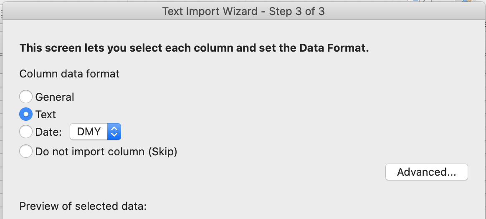

# taxtool

[](https://badge.fury.io/js/taxtool)
[](https://github.com/TimDaub/taxtool/actions/workflows/node.js.yml)

taxtool is a tool that can help you file your crypto currency taxes. It's NOT
an all-encompassing tool that will accompany throught your annual tax life
cycle. Instead, its aim is to provide tools that do a single job well to help
you and your accountant to file your taxes in time.

## Data Acquisition

taxtool won't help you collect your data from exchanges. I had to go through
that pain myself and I don't think I'm in a position to automate that yet.
However, most exchanges allow you to download some sort of CSV file. Take that
CSV file and try to map it onto the data format specified in the next section
and your tax accountant will thank you.

## Why Use taxtool?

There's many "better" tools on the internet. They allow you to create
connections to exchanges and they do "all the hard work" to make filling taxes
for crypto less complex. However, they all had problems that lead me to create
this small set of tools. Some problems I encountered in other tools:

- They did not respect my privacy by e.g. uploading my tax data into a cloud.
- They did impose an opinionated approach towards calculating my tax return.
- They were so huge/complex/properietary that it was impossible for me or my
  tax accountant to verify that their calculations were correct.

That's why I ended building `taxtool` myself. My goal is to build a tool that
supports an offline-first workflow. It doesn't impose opinion or
juristicional-specific logic on the data. taxtools purpose is to deliver clean
and factual data to financial authorities such that when they decided how they
want to tax crypto, they can do so with my data. I want to build taxtool such
that it remains a small and well-tested code base.

## Data Format

`taxtool` works with `.csv` files. It mandates a canonical header structure:

```csv
type,location,asset,amount,exchanged_amount,exchanged_asset,datetime
buy,coinbase,ETH,1.5,1.5,EUR,2021-03-17T11:32:48.468Z
buy,coinbase,ETH,1.5,1.5,EUR,2021-03-17T11:32:48.468Z
```

taxtool uses this data structure as my accountant and I found this
structure useful.

### Properties

- `type` is either `{"sell", "buy"}`.
- `location` is an arbitrary string referring to the exchange of the trade.
- `asset` is the ticker value of the asset, e.g. Ethereum is "ETH".
- `amount` is the amount of `asset`.
- `exchanged_amount` is the amount of `exchanged_asset`.
- `exchanged_asset` is the counter asset ticket of `asset`, e.g. Euro is "EUR".
- `datetime` is the ISO 8601 time the action executed. Note that ISO 8601 assumes
  UTC as its default time zone.

### Notes

- taxtool uses [moneysafe](https://www.npmjs.com/package/moneysafe) to ensure
  precision for financial calculations.

## Installation

```bash
$ npm i -g taxtool
```

Alternatively, you can clone this repo and use `npx taxtool --help` to run
commands.

## Usage

### `--help`

```bash
$ taxtool --help
```

### Using `--parse, -p`

The purpose of the `--parse` option is help you format your .csv file into the
canonical `taxtool` format layed out a few sections above. Successfully parsing
your .csv file will allow you to use further functionality of `taxtool`.

```bash
$ taxtool trades.csv --parse > parsed.csv
$ cat parsed.csv
> type,location,asset,amount,exchanged_amount,exchanged_asset,datetime
> buy,coinbase,ETH,1.5,1.5,EUR,2021-03-17T11:32:48.468Z
> ...
```

### Using `--formatdatetime, -f`

Assuming you have a date of the format `28/05/2017 13:18:12 Z`, then you can
use the format string `dd/MM/yyyy HH:mm:ss X` according to [date-fns's
`parse`](https://date-fns.org/v2.8.1/docs/parse). Please don't forget including
timezone information in your date strings as otherwise the data may be
incorrectly shifted in relation to UTC.

trades.csv
```csv
> type,location,asset,amount,exchanged_amount,exchanged_asset,datetime
> buy,coinbase,ETH,1.5,1.5,EUR,17/03/2021 11:32:48
```

```bash
$ taxtool trades.csv --parse -f "dd/MM/yyyy HH:mm:ss"
> type,location,asset,amount,exchanged_amount,exchanged_asset,datetime
> buy,coinbase,ETH,1.5,1.5,EUR,2021-03-17T11:32:48.468Z
> ...
```

**Please note** that taxtool assumes all datetimes in your computer's time
zone. It will, however, output [ISO
8601](https://developer.mozilla.org/en-US/docs/Web/JavaScript/Reference/Global_Objects/Date/toISOString)
in the "UTC" timezone indicated by the "Z" suffix.

### Using `--checkduplicates, -d`

There could be cases where your file includes two times the exact same trade.
However, you want to make sure to remove all duplicates. By using `-d`, all
trades of a file will be comparred with each other and in case of a duplicate
an error will be thrown.

### Using `--calcbalance, -b`

To check a document's plausibility or to see a year's revenue, `--calcbalance`
can be used. As an string input it takes an asset name e.g. "ETH" and will then
extend the output by adding two new colums `{assetName}_BOUGHT` and
`{assetName}_SOLD`. 

trades.csv
```csv
type,location,asset,amount,exchanged_amount,exchanged_asset,datetime
buy,coinbase,ETH,1,1,EUR,2021-03-17T11:32:48.468Z
sell,coinbase,ETH,1,1,EUR,2021-03-17T12:32:48.468Z
sell,coinbase,EUR,1,1,ETH,2021-03-17T13:32:48.468Z
buy,coinbase,EUR,1,1,ETH,2021-03-17T14:32:48.468Z
```

```bash
$ taxtool ./test/fixtures/testfile_balance.csv -p --calcbalance "ETH"
type,location,asset,amount,exchanged_amount,exchanged_asset,datetime,ETH_BOUGHT,ETH_SOLD
> buy,coinbase,ETH,1.000000000000000000,1.00,EUR,2021-03-17T11:32:48.468Z,1.000000000000000000,0.000000000000000000
> sell,coinbase,ETH,1.000000000000000000,1.00,EUR,2021-03-17T12:32:48.468Z,1.000000000000000000,1.000000000000000000
> sell,coinbase,EUR,1.00,1.000000000000000000,ETH,2021-03-17T13:32:48.468Z,1.000000000000000000,2.000000000000000000
> buy,coinbase,EUR,1.00,1.000000000000000000,ETH,2021-03-17T14:32:48.468Z,2.000000000000000000,2.000000000000000000
```

This allows us to conclude that on `2021-03-17T14:32:48.468Z` (the last trade),
the user bought 2 ETH and also sold 2 ETH.


### Other Options

- `--silence, -s` supresses the standard outputs.
- `--delimiter, -l` can be used to define a preferred delimiter in the output
  file, e.g. `taxtools -l ";" ...`

## Usage with Microsoft Excel

The output of taxtool is supposed to be compatible with tools like Microsoft
Excel. However, note that these tools carry assumptions about a user's cultural
environment. For example, in Germany the usage of `.` and `,` are swapped when
comparred to e.g. English accounting. taxtools will always output numbers with
high precision through the use of
[moneysafe](https://www.npmjs.com/package/moneysafe).

To use an up-to-date version of Excel, however, it may be required to label
some columns in the text-import wizard as "Text" and not "General".
Additionally, the `--delimiter, -l` function can help.



## Changelog

### 0.1.0

- Add `--silence, -s` option
- Add `--checkduplicate, -d` option
- Add `--delimiter, -l` option
- Add `--calcbalance, -b` option

### 0.0.1

- Initial release

## License

See [LICENSE](./LICENSE)

## Further reading

- https://plaintextaccounting.org/
